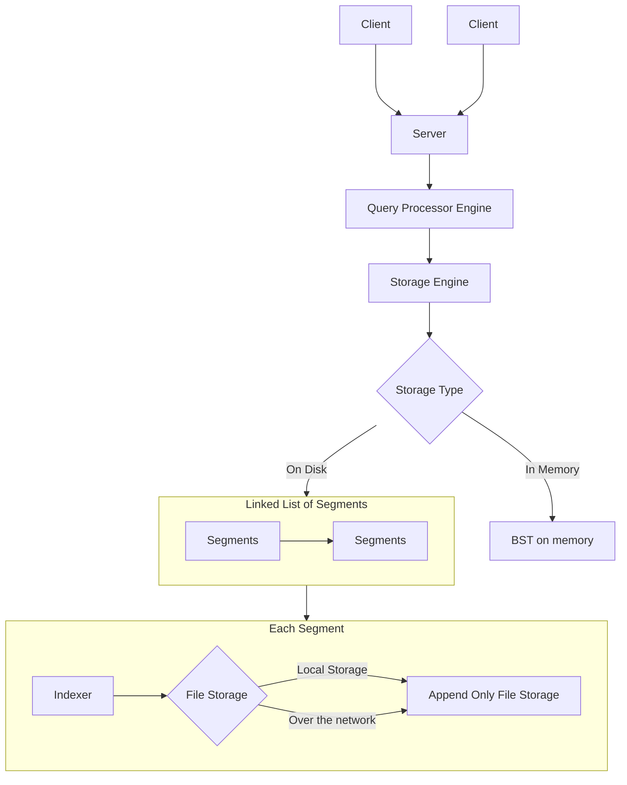

# QuickByte

A Key Value store, where the underlying storage exits either in-memory or on-disk. 
Initially starting off as an implementation of a basic DB using an append only file, now has evolved into a key-value store, having a BST that can be operated on by large number of threads.

Although both in-memory and on-disk options are supported, a lot more work has gone in to making the on-disk BST as efficient as possible, as a result there are lots of scope for improvement on the outer layers of the key-value store such as the Query Processor and the Server.

## High Level design


## Instructions to run

### Client

Client uses GNU's `readline` library

```
sudo apt-get install libreadline6 libreadline6-dev
```

To compile the client
```
make cli
```
To run,
```
./cli/cli.out
```

### Server

To compile the sever
```
make server
```
To run
```
./server/server.out
```

### Testing

#### Testing the Query Processor
```
make test-query-engine
./test.out
```
Currently tested 10,000 threads upserting, deleting and writing into the bst concurrently 
#### Testing the in-memory storage engine
```
make test
./test.out
```

## CLI 


## Team
* [shreyasseshadri](https://github.com/shreyasseshadri) - Developer
* [srinskit](https://github.com/srinskit) - Program Manager
